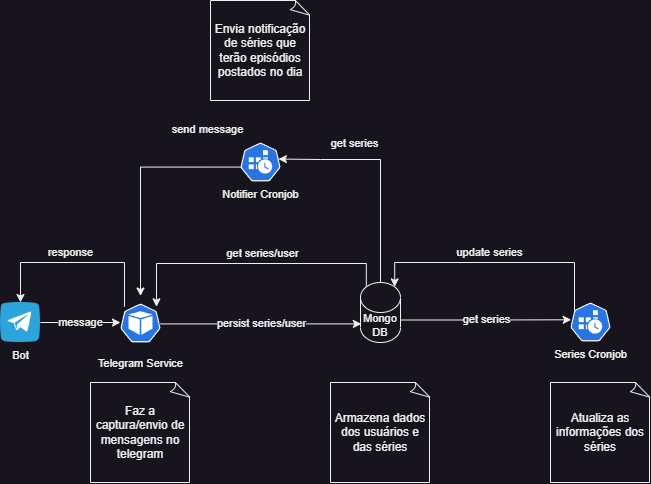

# Projeto de estudo - Kubernetes

Nesse projeto tentei criar uma arquitetura simples, com o objeto de notificar um usuário sobre o lançamentos de episódios de suas séries. Dentro da estrutura principal temos algumas aplicações já implementadas e outras que ainda faltam implementação.

- Uma aplicação que faz poolling das mensagens no telegram e processa os comandos do bot no telegram
- Uma aplicação que atualiza dados das series (data de lançamento dos episódios) que estão no mongo
- Uma aplicação que verifica diariamente se tem episódio a ser lançado
- Uma aplicação para notificar quando houver erro no serviço, através de outro bot do telegram.

Para os cronjob decidi usar apenas javascript por ser aplicações mais simples. Já para o serviços decidi utilizar o framework nest para facilitar o desenvolvimento, caso fosse evoluir a aplicação. Uma utilidade para esse projeto é poder quebrar em partes e no futuro substituir os serviços por outros, utilizando linguagens diferentes ou mesmo frameworks diferentes.

Cada serviço tem um arquivo <b>run_pipeline.sh</b> que sobe a aplicação em um registry na máquina remota (no meu caso 192.168.0.50) e sobe as aplicações para o kubernetes.

A ideia é utilizar evoluir essa estrutura e adicionar recursos de observabilidade (prometheus e grafana).

Abaixo está a estrutura inicial pensada para o projeto.

Tecnologias usadas nesse projeto: 

